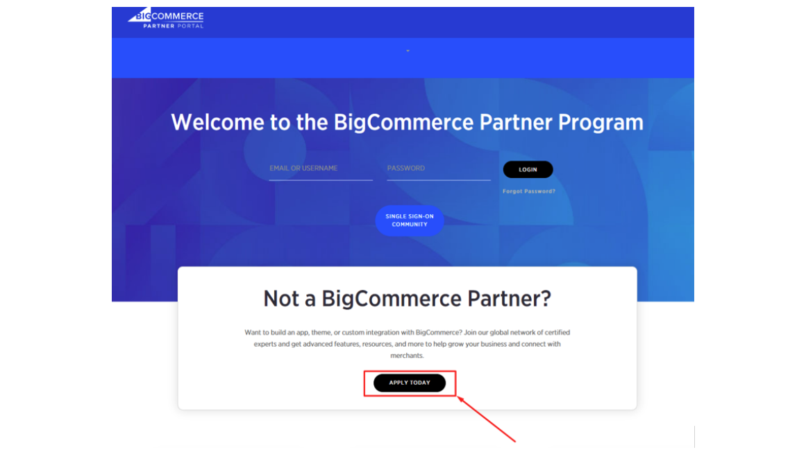
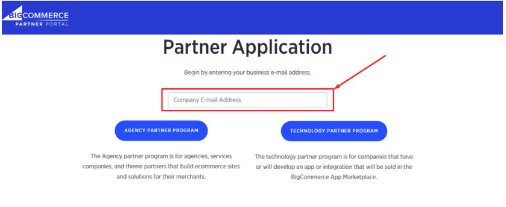
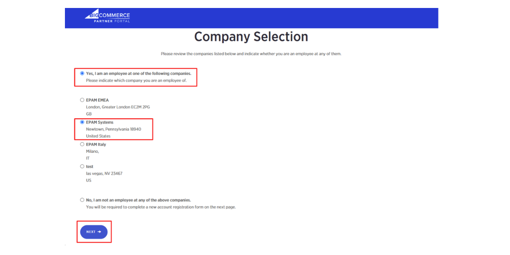
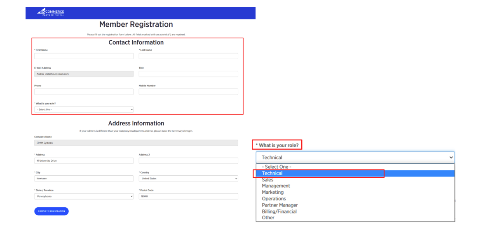
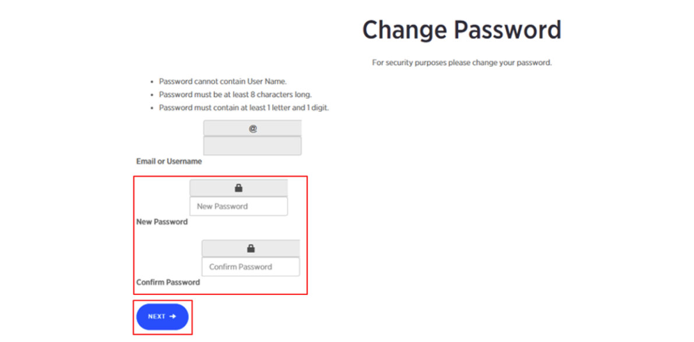
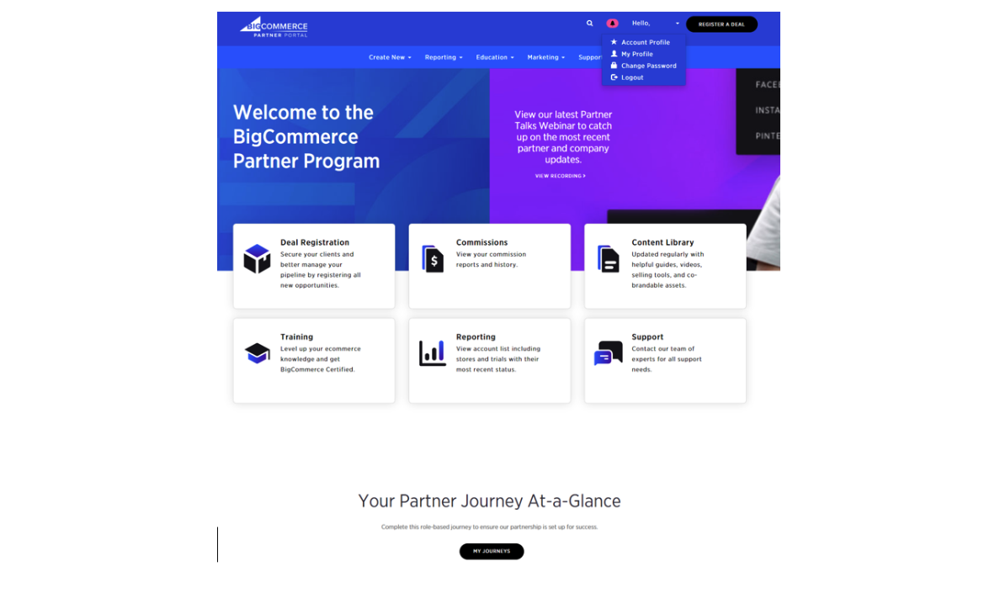

+++
title = "1. Registration in a partner portal"
weight = 13
+++

## Register in a partner portal first.

In order to register

1. Log into Bigcommerce partner portal using the following link: https://partners.bigcommerce.com/English/Solutions/home.aspx

2. Select «Apply today» button for the registration process:
   

3. Paste your EPAM email into «Company E-mail Address» field and click «Technology partner program»:
   

4. In opened «Company Selection» section, check «Yes, I am an employee of the following companies» and «EPAM Systems» checkboxes, click «Next»:
   

5. In opened «Member registration» section fill your Contract Information (First name, Last Name, Title). Select «Technical» role from drop-down «What is your role?» menu and click «Complete registration»:
   

6. Check your EPAM email and find there the letter with personal default credentials (username and password) for logging into log into Bigcommerce partner portal.

7. Log into Bigcommerce partner with credentials from the previous clause.

8. Change the default password and click «Next»:
   

9. Congratulations, your registration is finished successfully, and you can start your journey!
   
