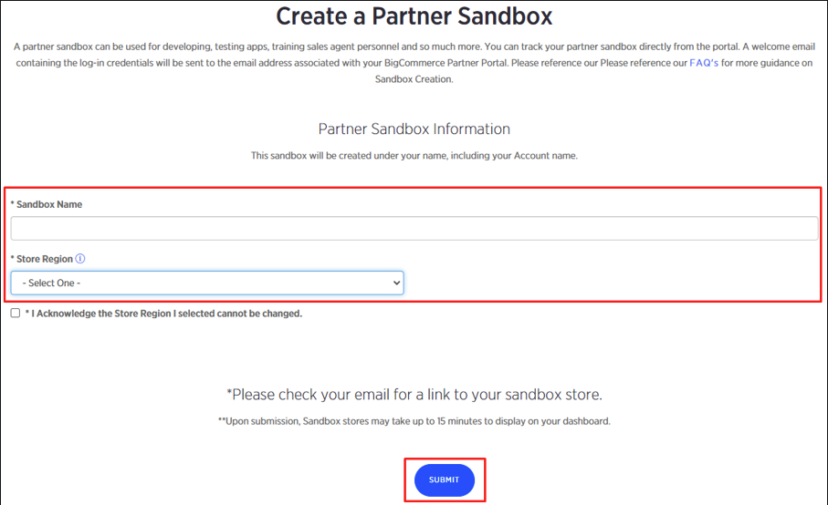
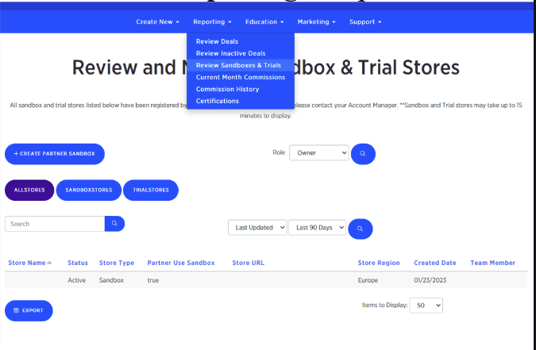

+++
title = "2. Create a sandbox"
weight = 13
+++

## Just follow the steps below

1. Log into the Bigcommerce partner portal at https://partners.bigcommerce.com with your credentials.

2. Select «Partner Use Sandbox» from the «Create New» drop-down menu
   

3. Fill the «Sandbox Name» field and choose your region from the «Store region» drop-down menu and click «Submit» button
   

4. You will receive a letter from BigCommerce with the completion of the BigCommerce account procedure and details of the newly created Sandbox Store

5. Now you can log into your Sandbox Store via the link provided in the letter mentioned in the previous clause. You can also review and manage your Sandboxes. For that, click «Review Sandboxes & Trials» from the «Reporting» drop-down menu.
   
