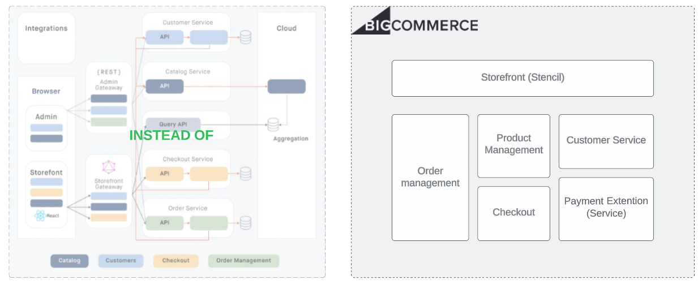

+++
title = "1. What is BigCommerce?"
weight = 13
+++

BigCommerce is an E-Commerce platform which allows business to build a store and sell their products or services digitally. That is actually so easy to start with so that they can create and run their online stores remotely as long as they have connections to a web browser and the Internet.

As any other platform, BigCommerce has their limitations. I will list a couple of them below. The whole list you may find at https://support.bigcommerce.com/s/article/Platform-Limits?language=en_US

- Store-level API accounts                              - 50
- API Calls (Trial Stores, Standard and Plus plans)	    - 20,000 per hour
- API Calls (Pro plans)	                                - 60,000 per hour
- API Calls (Enterprise)	                            - Unlimited
- API Calls (Enterprise)	                            - Unlimited
- Maximum WebDAV file size for imported files           - 512 MB
- Maximum images per variant                            - 1
- Maximum option values per option	                    - 250
- Maximum images per product	                        - 1000
- Maximum categories per store	                        - 16,000
- Maximum categories per product	                    - 1,000
- Maximum brands per store	                            - 30,000
- Maximum featured products (Stencil)	                - 25

