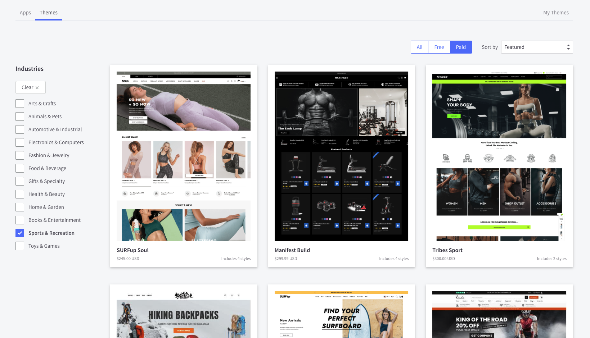

+++
title = "2. How to use BigCommerce?"
weight = 13
+++

It should NOT be something new for you, but first of all define the requirements, available financial and human resources, deadlines and restrictions

## Choose your way taking all this in mind

1. Headless approach. A "Headless Website" is one where the software running the backend administration part of a site (the “body”) is separate from the software running the frontend, presentational part (the “head”). They operate independently on separate systems/servers and communicate with each other via APIs.

In other words you can use BigCommerce API and choose any framework or technology in order to implement frontend part.

Pluses:

- Flexibility. Frontend will be as flexible as you have implemented it.
- Better control of frontend part.
- Faster Scaling. Because the front-end is separate, developers have fewer constraints when it comes to making updates. This can potentially lower your operating costs while increasing your time to market.

Minuses:

- Additional costs. It requires own hosting and maintainance for frontend.
- Potentially bigger and more experianced team of frontend developers. Which adds additional costs as well.
- Depending on implementation, there could be delay in updating site content and marketing campaigns needs.
- Requires time for implementation.

You can review more at https://developer.bigcommerce.com/api-docs/storefronts/guide/overview
BigCommerce API you may find here https://developer.bigcommerce.com/docs/api

2. Usage of Stencil Theme. Stencil is BigCommerce's theme engine. Merchants and developers can choose for free or paid from the best responsive ecommerce templates on the market filtering by industry.
   

Pluses:

- Zero coding could require. Merchants could just find a theme which suites them and customize it in admin panel.
- Lower costs. No need to host frontend, lower costs on DEV team.
- Support local debugging.
- Offer great user experience.
- Short time to start online store.

Minuses:

- Less flexibility. Could be quite complecated to add a custom feature into existing theme.
- Developers have to customize the code written by theme authors, if customization is required.
- Could be boring for developers to work with handlebars and css.
- Handlebars helpers could not be extended.
