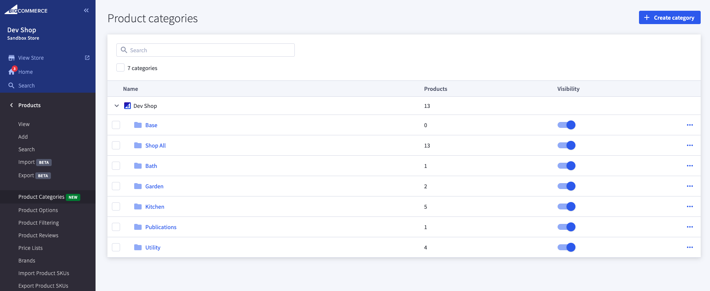
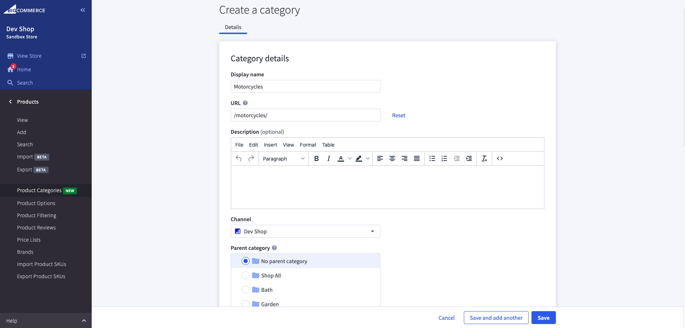
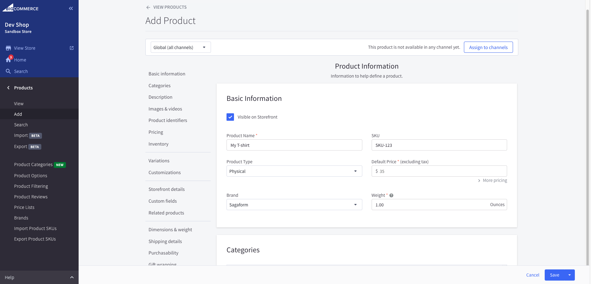
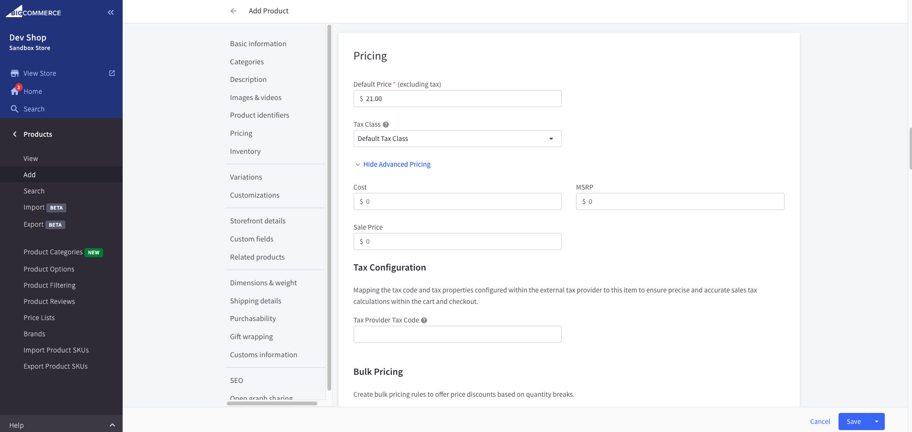
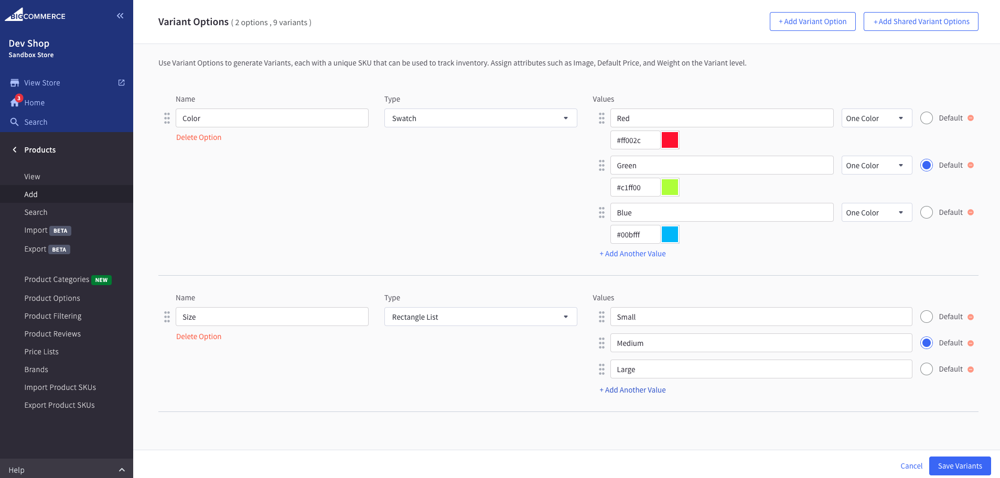
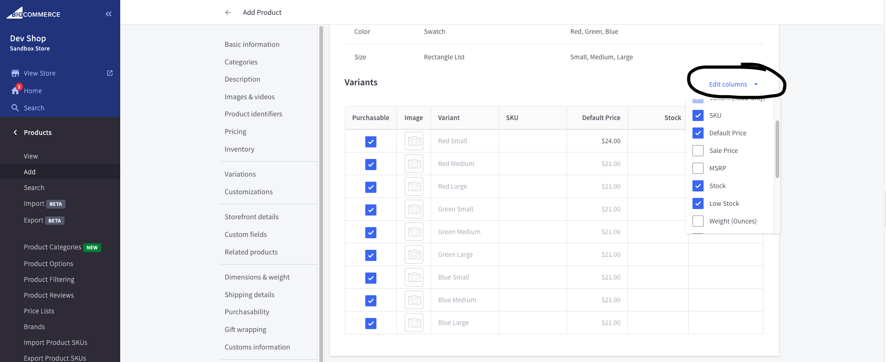

+++
title = "1. Configure Products Catalog"
weight = 13
+++

## Configure you categories in order to group products.

1. Open Control Panel > Products > Product Categories.
   

2. Add your category. All the settings quite simple. Let's add Display name, sort order (position in list of categories), default product sort (sorting on the category page), category image. you can review how category looks at storefront.
   

## Let's configure a product.

3. Open Control Panel > Products > Add.
   
4. Let's set up a product in the following way:

- Add Product name
- Enter SKU
- Enter Default Price
- Fill in Weight
- Choose a Category
- Fill in Description
- Choose Images
- Let's pricing sections as it's. But as you see it's possible to use advanced price customization.
  
- Let's start tracking inventory on a variant level
  
- Add your variants at next section
  
- Let's edit variants table columns. Add "Stock" and "Low Stock" columns
  
- You can add different images for each variant as well as changing price and stock level
- Let's add "Custom Fields". You may use html as a value. Additionaly you may use them
- Review Shipping Details section before save. I would like to point out that some settings could be configured at different levels. For example shipping details at product level and just in settings

5. Save the product.

6. Navigate to storefront and review the product in recently created category.
