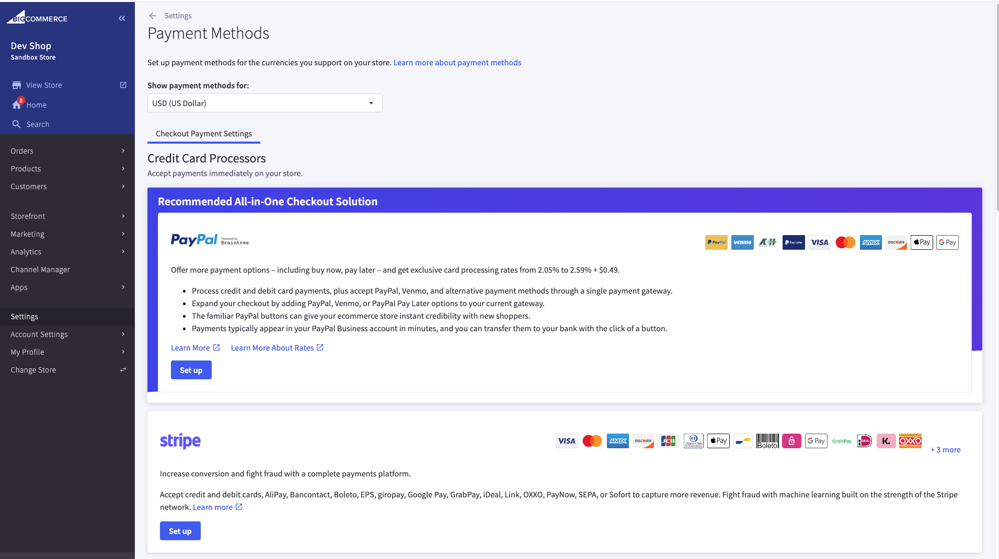
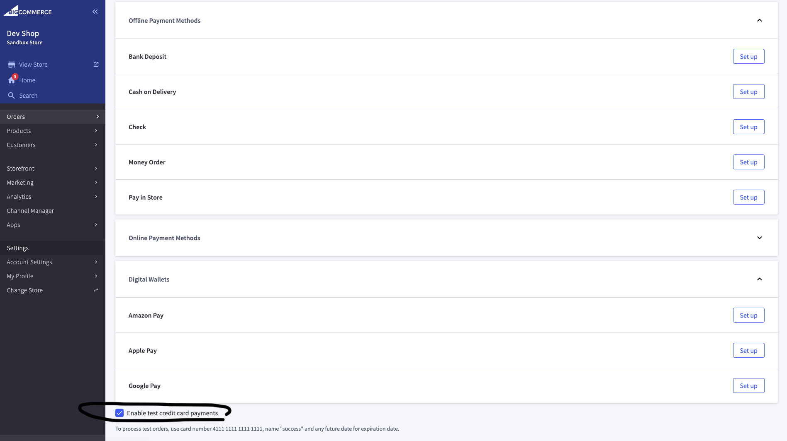
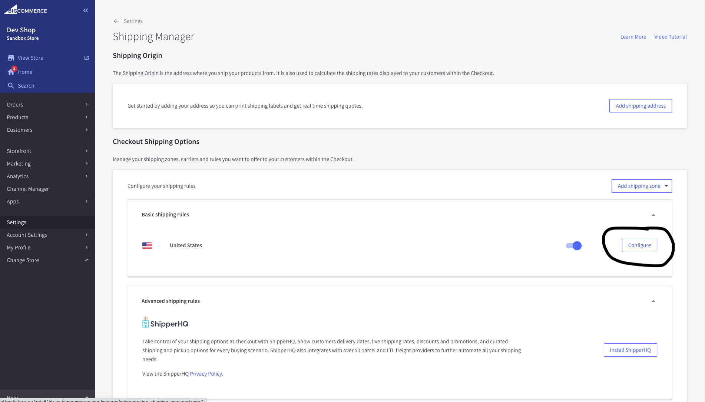
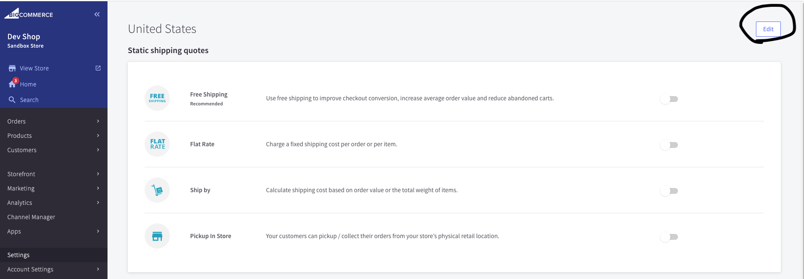
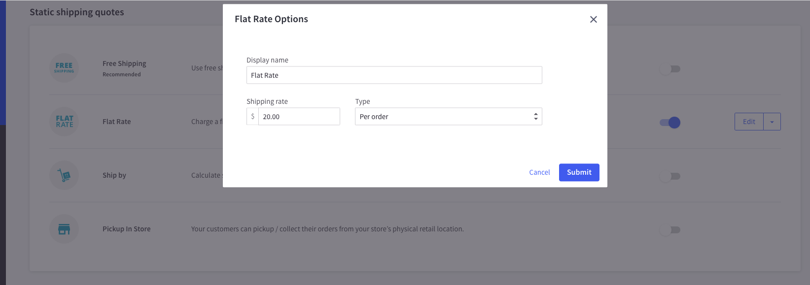
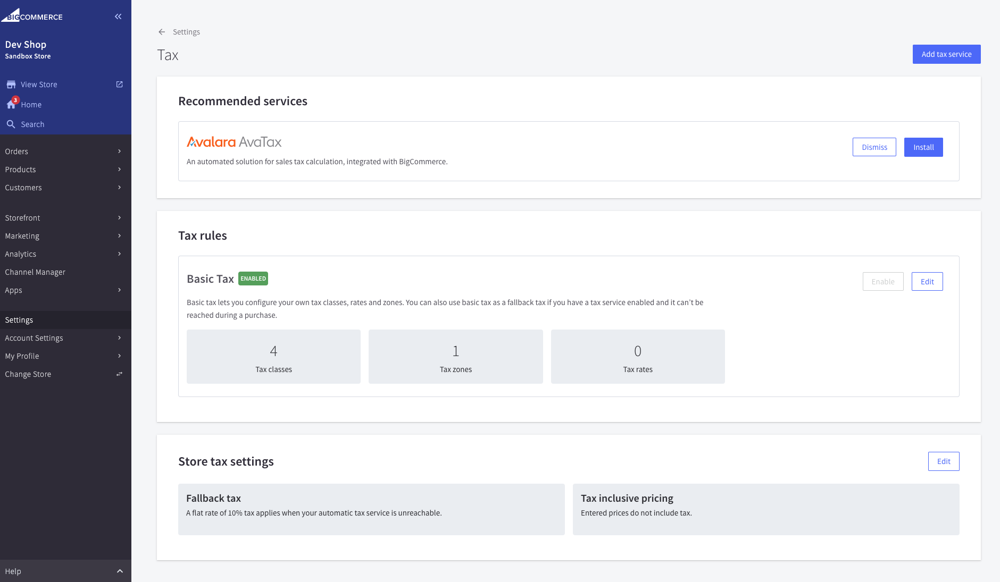

+++
title = "2. Basic set up"
weight = 13
+++

## Let's review and set up basic settings to make end to end scenario working.

1. Open Control Panel > Settings > Payments. You can set up store payments here. No need for now.
   

2. Review "Enable test credit card payments" is enabled. It allows you to test ordering process.
   

3. Open Control Panel > Settings > Shipping. Let's update basic shipping rules.
   

4. Here we can add a country. Click on "Edit" button on the top left and add you country.
   

5. Let's enable "Flat Rate" shipping. Update shipping rate and save.
   

6. Open Control Panel > Settings > Tax. Here it's you can connect your tax provider, set up fallback strategy if provider is unavailable. Let's leave it as it's.
   

## We are done and ready to go end to end.
