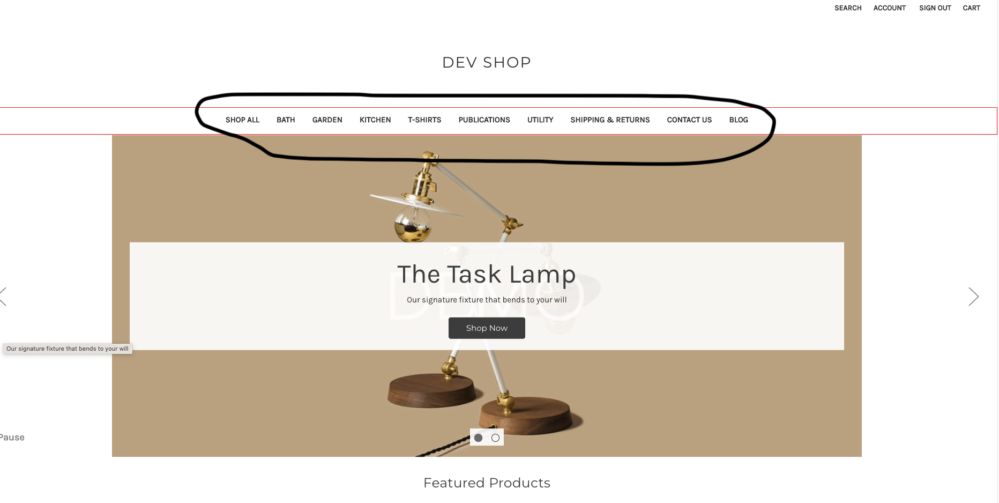
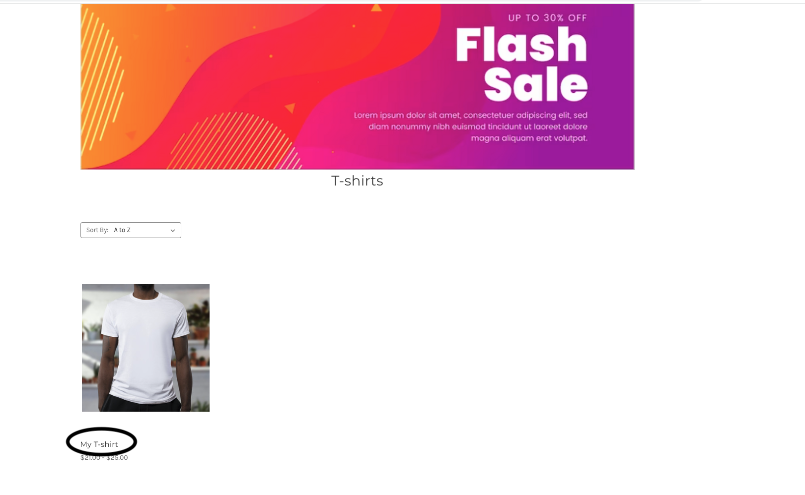
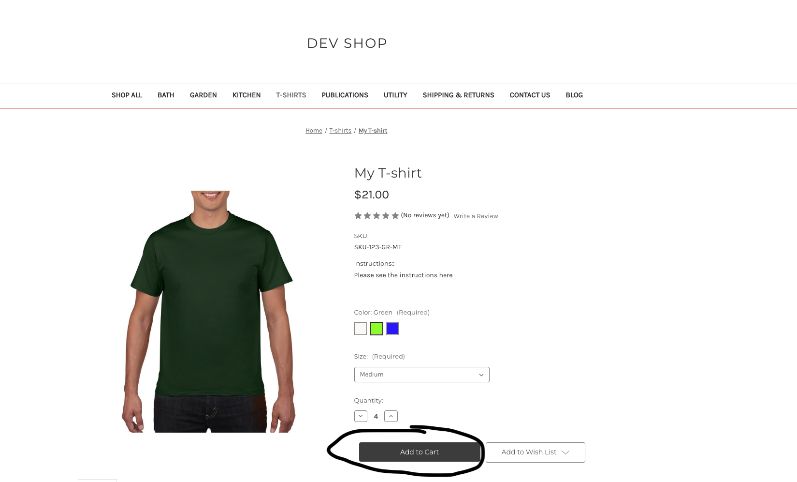
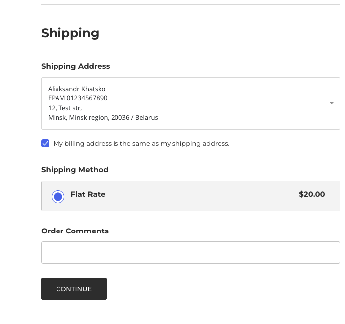
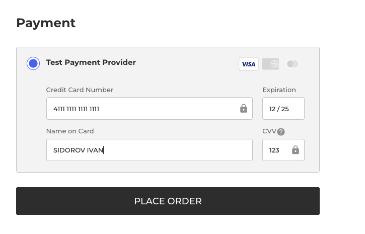
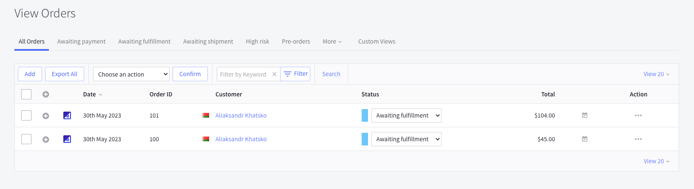

+++
title = "3. Orders"
weight = 13
+++

## Eventually let's go end to end.

1. Navigate to a store and click on a category you've added before.
   

2. Click on your product name.
   

3. Choose variant options, quantity and click "Add to Cart".
   

4. Proceed to checkout.

5. You might have to sing in passing Customer section.
   

6. Choose address and shipping method you've added before and click "Continue".
   

7. Fill in "Payment" section.
   - Credit Card Number: 4111 1111 1111 1111
   - Expiration: any date in future: 12/25
   - Name on Card: any name
   - CVV: any 3 digits
     
8. Place order.

## Let's review orders customers placed.

Open Control Panel > Orders. Here store managers could change statuses and perform other manipulations with orders.

