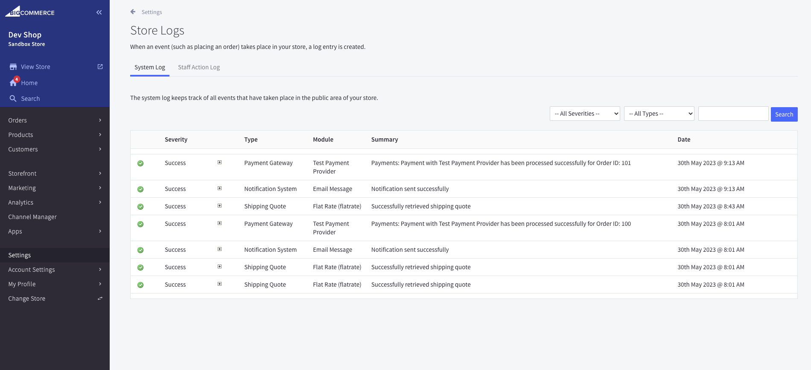

+++
title = "5. Logs"
weight = 13
+++

## You could need to review store logs.

Just open Control Panel > Store Logs and you will see store logs. Unfortunately, it's not possible to set up alerting if an error occured.

