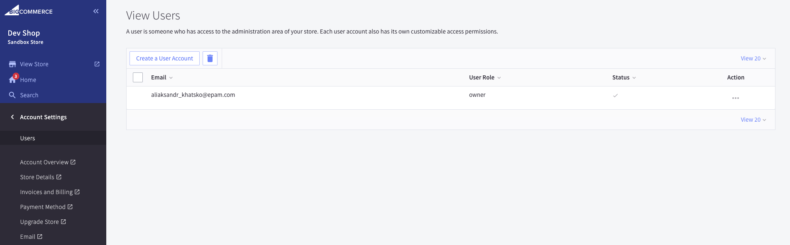
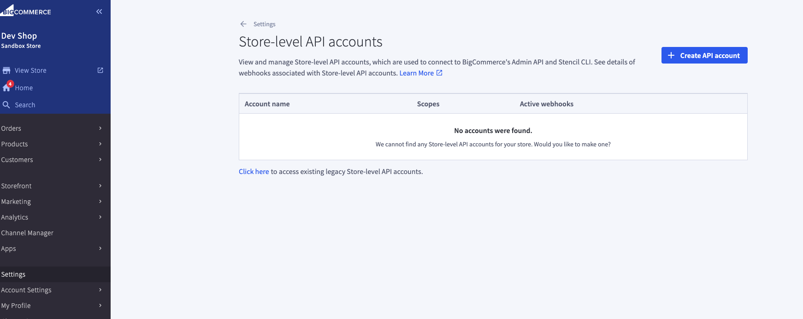
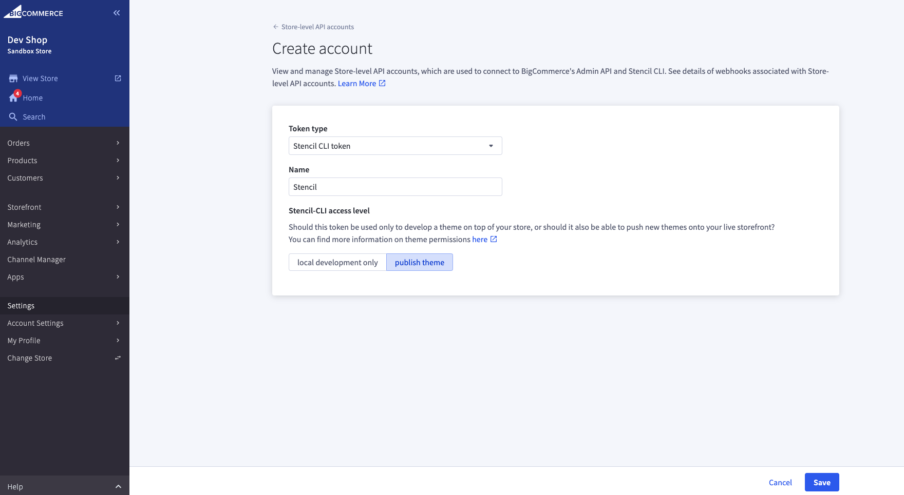

+++
title = "1. Access Configuration"
weight = 13
+++

## Let's create a user with access to control panel

Open Control Panel > Account Settings > Users > Create a User Account. You can set different permissions for you team members.

## In order start your store locally or deploy you will require stencil token.

1. Open Control Panel > Settings > Store-level API Accounts.
   

2. Click on "Create API Account" button.

3. Choose 'Stencil CLI token' token type.

4. Enter token name.

5. Choose "publish theme" access level.

6. Click "Save" button

   

7. You can save Terminal Quickstart command for next part.

   ## Homework Part 1.

   1. Create token with 'V2/V3 API token' token type.
   2. Play with BigCommerce API using the token. https://developer.bigcommerce.com/docs/api

   ## omework Part 2.

   1. Open Control Panel > Settings > Storefront API Playground.
   2. Play with BigCommerce API with GraphQL Playground.
