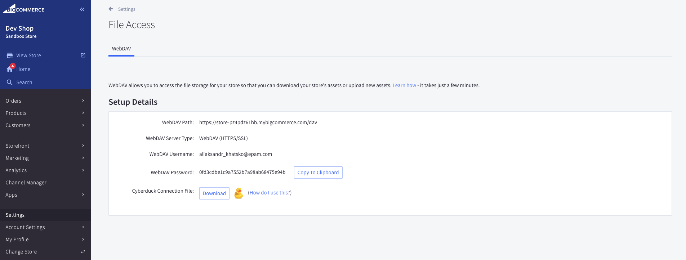
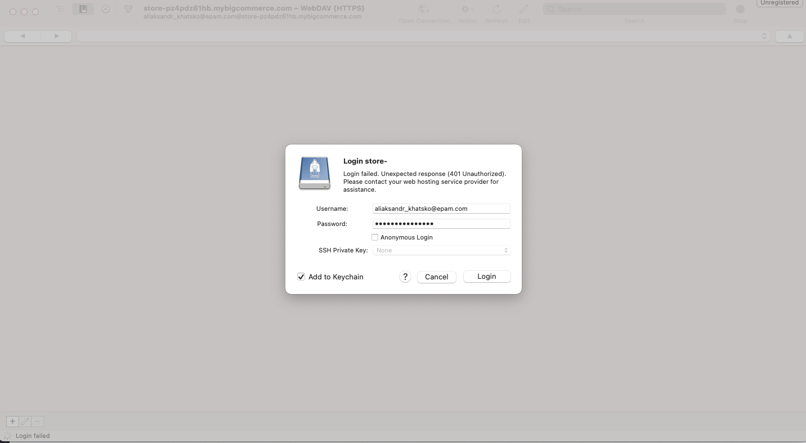

+++
title = "4. WebDAV"
weight = 13
+++

## You may need to upload custom fonts or images or even checkout into a file storage.

Great news! BigCommerce has this out of the box.

Web Distributed Authoring and Versioning or WebDAV is a protocol whose basic functionality includes enabling users to share, copy, move and edit files through a web server.

In order to upload files you need:

1. Download and install cyberduck https://cyberduck.io/download/

2. Open Control Panel > Settings > File access (WebDAV). If you are not an store owner, your user should have this specific permission enabled.
   

3. Copy WebDAV password and download conection file.

4. Double-click on downloaded file, paste password and click login.
   

5. You may use content folder for you purposes. Unfortunatelly it's not possible at sandbox or even trial store. But please, see below examples how it could be used:

- fonts from content/fonts folder

```
        <style type="text/css" media="screen, print">
            @font-face {
                font-family: "Aeonik";
                font-weight: 400;
                font-display: 'swap';
                src: url("{{cdn 'webdav:fonts/aeonik/Aeonik-Regular.otf'}}");
            }
            @font-face {
                font-family: "Aeonik";
                font-weight: 700;
                font-display: 'swap';
                src: url("{{cdn 'webdav:fonts/aeonik/Aeonik-Bold.otf'}}");
            }
        </style>
```

- image from content/img folder

```
        
```

### I will demonstrate one more example later.
