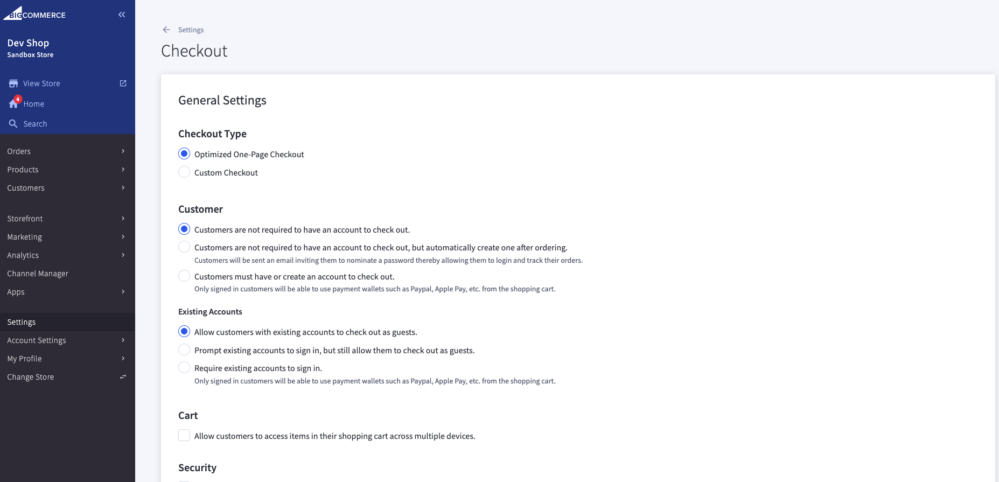

+++
title = "1. Checkout Configuration"
weight = 13
+++

## Default checkout

Open Control Panel > Account Settings > Checkout.

As you may see, "Optimized One-Page Checkout" is used by default. You will not have any control to it except the settings you may see on the opened page. You will also have an ability to update styles, but this option is also restricted as it's recommended to use only existings css selectors. Actually all checkout styles are in "optimized-checkout.scss" file
