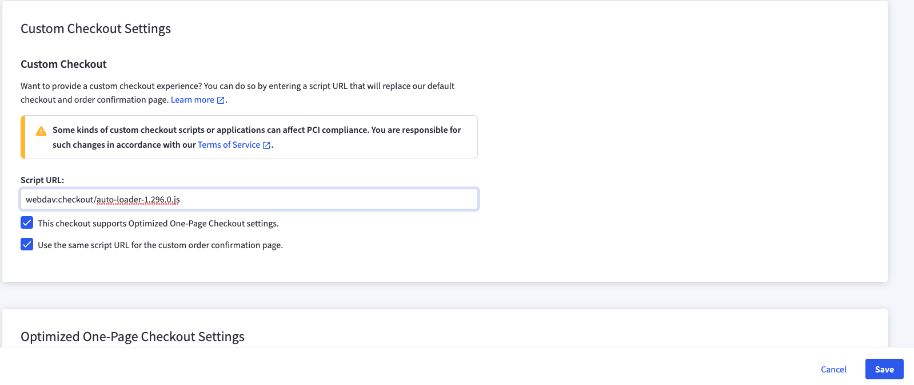

+++
title = "2. Custom checkout"
weight = 13
+++

## If you would like to have a bit more control you may use custom checkout. Let's see how you can enable it.

Detailed documentation you may find at https://developer.bigcommerce.com/stencil-docs/customizing-checkout/installing-custom-checkouts

The steps are quite simple.

1. Download the same checkout as BigCommerce use under the hood from https://github.com/bigcommerce/checkout-js

2. Upload all files and folders from dist folder into webDAV content/checkout folder.

3. Open Control Panel > Settings > Checkout.
   - Choose "Custom Checkout" checkout type.
   - Enter script URL at "Custom Checkout Settings" section, e.g. webdav:checkout/auto-loader-1.296.0.js
   - Select "This checkout supports Optimized One-Page Checkout settings." "Use the same script URL for the custom order confirmation page." checkboxes.
     

### With this settings you will get the same checkout as you have by default. At the same time you will be able to customize it.
