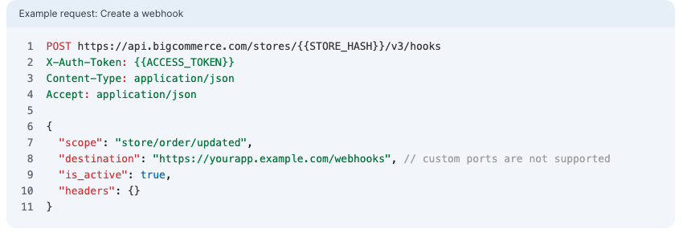
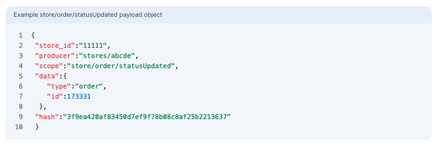

+++
title = "1. Webhooks"
weight = 13
+++

Webhooks notify applications when specific events occur on a BigCommerce store. For example, when:

- an order is created,
- a product's inventory changes
- an item is added to a shopper's cart

Let's review example of webhooks usage:

Create webhook for specific event.

The destination is you integration endpoint which will take event payload and perform any required manipulations.

Please, see the example of payload below

The detailed documentation you may find at https://developer.bigcommerce.com/api-docs/store-management/webhooks/about-webhooks
