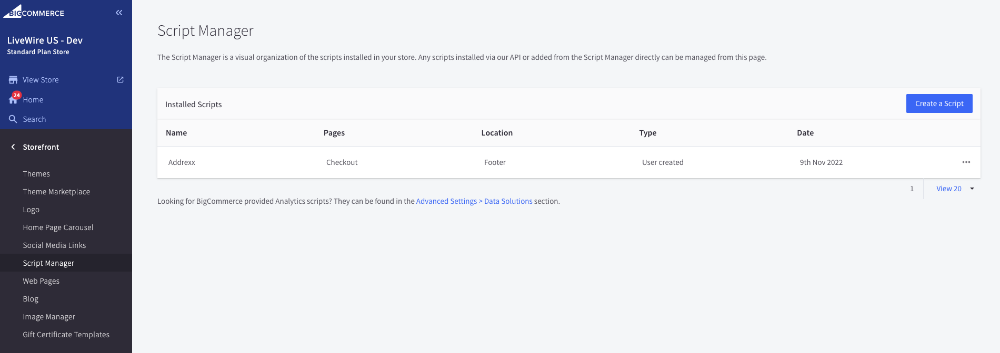

+++
title = "2. Extensions"
weight = 13
+++

BigCommerce has over 160 pre-made connectors with popular third-party apps for marketing, shipping, accounting, and more. You may find them all at https://www.bigcommerce.com/apps/

All of them connected in a different way and you may need to create storefront scripts in order to connect. Storefront scripts are not available at sandbox. But you may find them in Control Panel > Storefront > Script Manager

