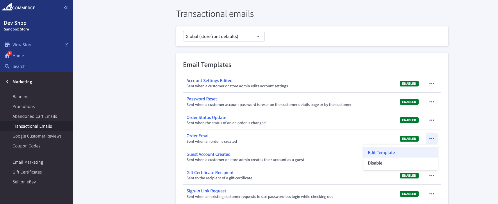
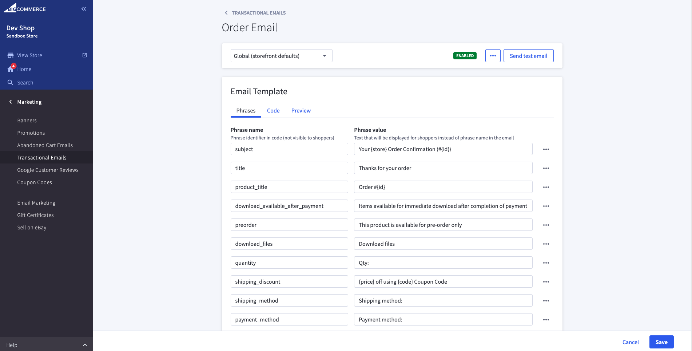

+++
title = "1. Email Templates"
weight = 13
+++

There are 2 types of email template, e.g. "Transactional Emails" and "Abadoned Cart Emails"

Let's review how to work with them.

1. Open Control Panel > Marketing > Transactional Emails.

2. Click on "Edit Template" option for a template.
   

3. You may update phrases used in code at "Phrases" section.

4. You may update the template itself at "Code" section.

5. You may preview and even send test email at "Preview" section.
   

### Actually, it's not quite easy to update email templates in Control Panel, so you may create a script which could update templates via API.
